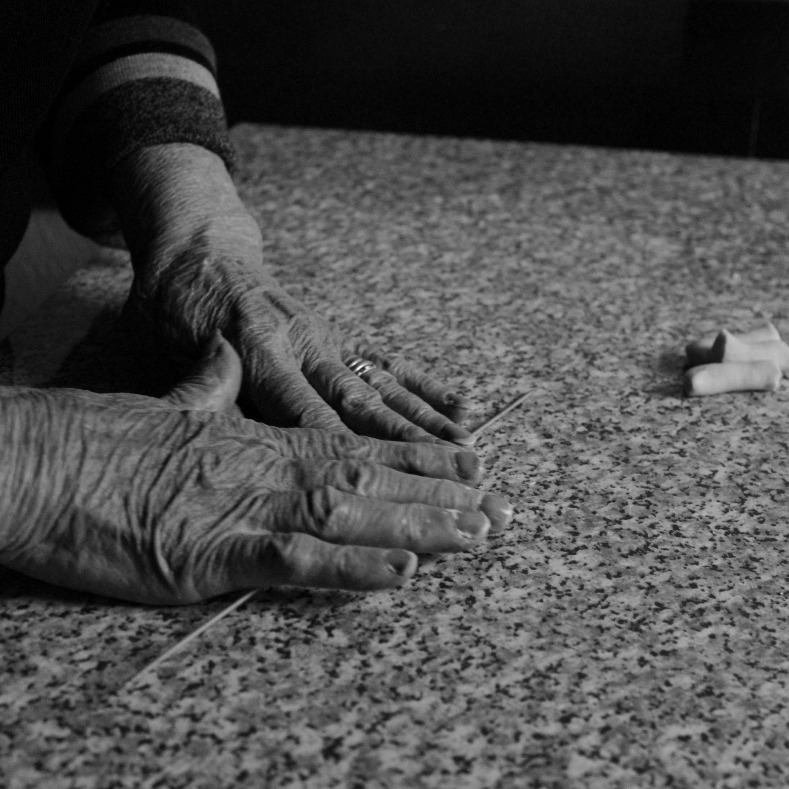
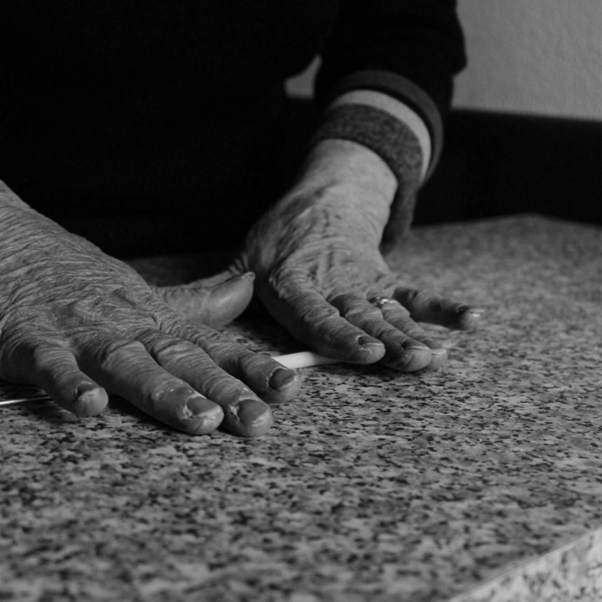
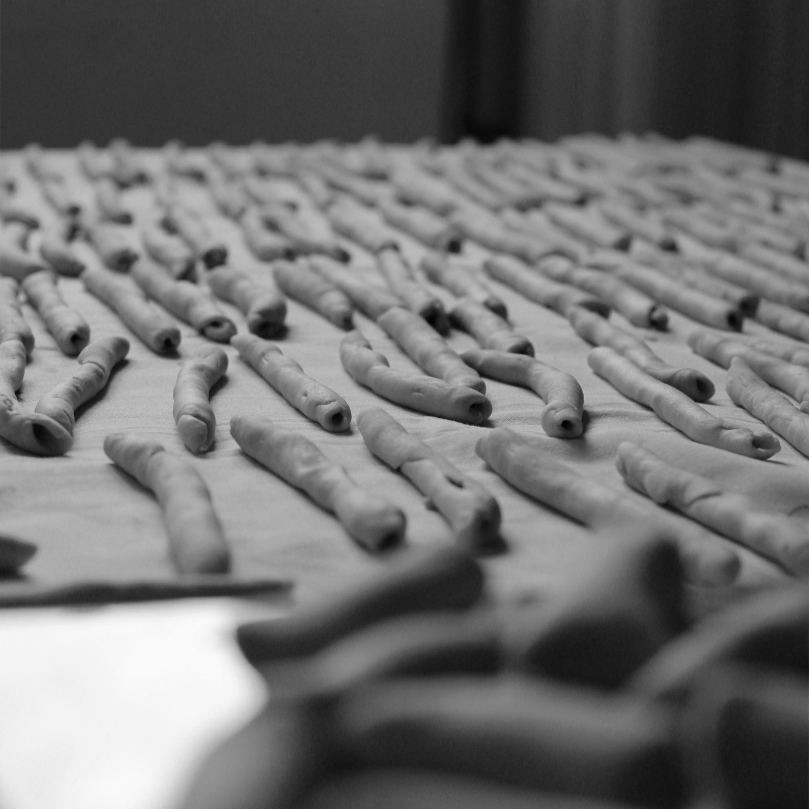
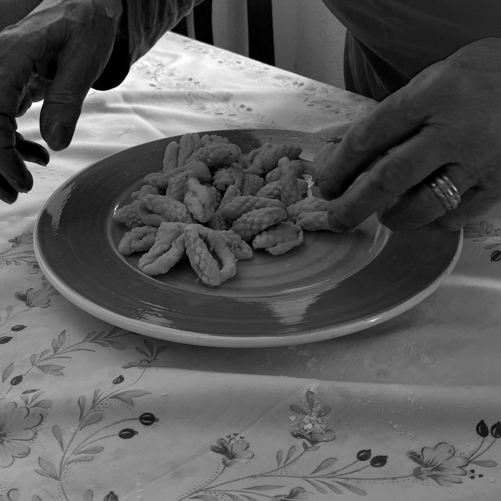
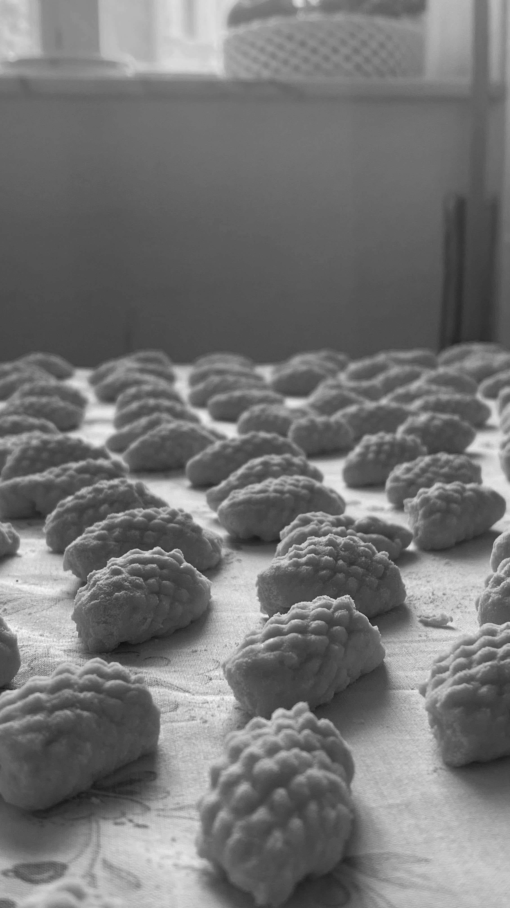
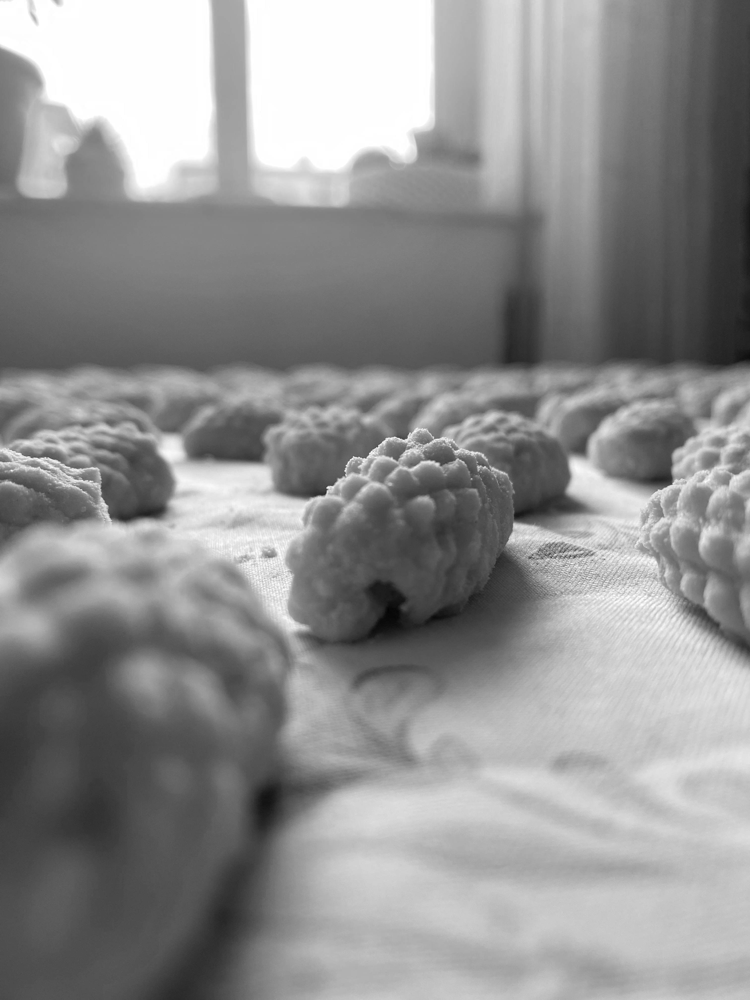

Ho sempre amato guardarla cucinare. 

Da bambina prendevo sempre un pezzo di impasto e ci giocavo,
  nella mia testa era come se gli stessi dando una mano.
 
 
Amo che con questo piccolo gesto riesce ad unire tutta la famiglia.

Maccheroni fatti in casa

Altro giorno, altra rimpatriata ma, questa volta...
 
 
...Gnocchi fatti in casa

Controlla anche
[il mio profilo instagram](https://www.instagram.com/annabrzn.git/) dove posto tutti i miei scatti e magari seguimi e metti like :)

